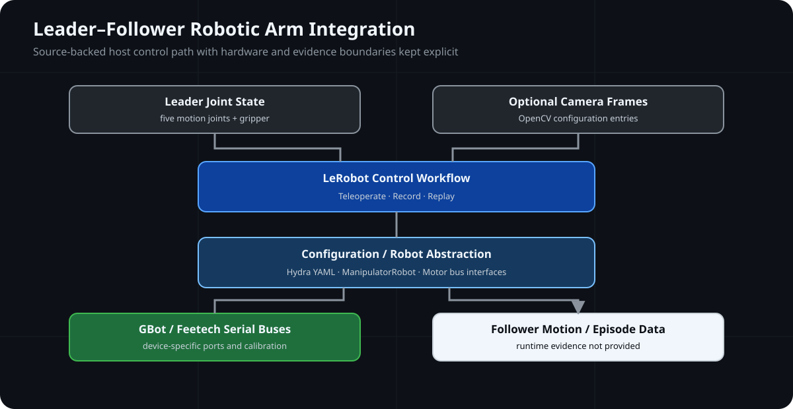

# Embodied-Robotics-Arm-Lab

基于 GenkiArm / LeRobot 代码基础的 leader–follower 机械臂集成实验，聚焦双臂配置、串口电机接口、相机输入与遥操作数据通路。

**🦾 Leader–Follower Control Path**



## System Snapshot

| Field | Current Scope |
| --- | --- |
| Language | Python 3.10 |
| Robot | SO-100-style leader / follower configuration |
| Motion Channels | Five arm joints plus one gripper channel per configured arm |
| Control | LeRobot teleoperate、record 与 replay workflows |
| Communication | USB serial motor buses；GBot leader 与 Feetech follower backends |
| Camera Interface | Optional OpenCV camera entries defined in configuration |
| Evidence | Source/configuration review and Python AST syntax validation completed；host functional tests、package build、hardware validation and runtime evidence not provided |

> 🧪 **Evidence:** 公开源码与配置入口可定位，Python AST syntax validation 已通过；host functional test、package build、机械臂硬件与 runtime evidence 尚未提供。

## 📌 Overview

仓库展示一条可阅读的机械臂系统集成路径：leader arm 提供关节输入，LeRobot control loop 根据 robot configuration 调用 motor bus abstraction，再向 follower arm 发送关节与夹爪命令。配置中同时保留两个 OpenCV camera 入口，用于支持图像采集接口。

公开内容由原创说明、架构图与一个经过边界筛选的 GenkiArm / LeRobot 第三方源码组成。它不是自主操作系统，也不把源码中存在的 policy、dataset 或 training interface 描述为已经训练或运行验证的能力。

## 🏗️ Architecture

```text
Leader Joint State / Optional Camera Frames
                    ↓
       LeRobot Control Workflow
        Teleoperate / Record / Replay
                    ↓
   Hydra Configuration / Robot Abstraction
                    ↓
 GBot Leader Bus / Feetech Follower Bus
                    ↓
 Follower Joint Commands / Local Episode Data
```

数据流由 [`control_robot.py`](third_party/genkiarm/lerobot/scripts/control_robot.py) 选择 `teleoperate`、`record` 或 `replay` 模式，并通过 [`so100.yaml`](third_party/genkiarm/lerobot/configs/robot/so100.yaml) 建立 leader arm、follower arm 与 optional cameras。电机通信由 [`GBotMotorsBus`](third_party/genkiarm/lerobot/common/robot_devices/motors/gbot.py) 和 [`FeetechMotorsBus`](third_party/genkiarm/lerobot/common/robot_devices/motors/feetech.py) 提供接口。

## 🦾 Robotic Arm Control

| Capability | Implementation Entry | Engineering Focus |
| --- | --- | --- |
| Leader / follower mapping | [`so100.yaml`](third_party/genkiarm/lerobot/configs/robot/so100.yaml) | 两组 motor bus、joint naming 与 gripper channel 配置 |
| Control workflow | [`control_robot.py`](third_party/genkiarm/lerobot/scripts/control_robot.py) | Calibration、teleoperation、record 与 replay mode selection |
| GBot motor transport | [`gbot.py`](third_party/genkiarm/lerobot/common/robot_devices/motors/gbot.py) | 230400-baud serial bus、motor register access 与 calibration mapping |
| Feetech follower backend | [`feetech.py`](third_party/genkiarm/lerobot/common/robot_devices/motors/feetech.py) | Follower motor access and joint command conversion |
| Camera configuration | [`so100.yaml`](third_party/genkiarm/lerobot/configs/robot/so100.yaml) | Two optional OpenCV camera interfaces |

具体端口、camera index、calibration data 与机械限位依赖实际设备。仓库没有把默认配置值描述为可直接适用于任意硬件。

## ✨ Key Features

- **Robot configuration path** — 使用 Hydra YAML 连接 robot、motor bus 与 camera interface。
- **Leader–follower workflow** — 源码包含 leader input 到 follower command 的 teleoperation 入口。
- **Serial motor abstraction** — 分离 GBot 与 Feetech motor backend，保留各自通信边界。
- **Optional camera interface** — 配置层定义 OpenCV camera 输入，但不声明实机相机验证。
- **Evidence-aware scope** — 区分源码存在、package build、hardware validation 与 runtime evidence。

第三方源码还包含 dataset、policy 与 training interfaces。这些接口属于所保留框架的 Reference Boundary；本仓库没有提供可复核的训练结果、模型性能或 autonomous manipulation evidence。

## 📂 Project Structure

```text
Embodied-Robotics-Arm-Lab/
├── README.md
├── LICENSE
├── THIRD_PARTY_NOTICES.md
├── docs/
│   ├── system-architecture.md
│   ├── control-flow.md
│   ├── hardware-interface.md
│   ├── development-environment.md
│   └── verification.md
├── assets/images/architecture/
│   └── robotic-arm-system-overview.svg
└── third_party/genkiarm/
    ├── LICENSE
    ├── NOTICE.txt
    ├── pyproject.toml
    ├── requirements.txt
    └── lerobot/
```

`third_party/genkiarm/` 仅保留与 Python package、robot configuration 和 control workflow 直接相关的已许可源码；dataset、model weights、runtime outputs、cache、images 与 mechanical meshes 不在公开仓库中。

## 📚 Documentation

- [System Architecture](docs/system-architecture.md)
- [Control Flow](docs/control-flow.md)
- [Hardware Interface](docs/hardware-interface.md)
- [Development Environment](docs/development-environment.md)
- [Verification](docs/verification.md)
- [Third-party Source Boundary](third_party/genkiarm/README.md)

## 🧪 Verification

### 💻 Host Test

**Status:** Not Provided. 当前公开仓库未提供独立的 host-side functional test 或 integration test。

**Syntax Validation:** Passed. Published Python source files completed AST syntax validation without syntax errors.

### 🔨 Build Verification

**Status:** Not Performed. 本机未提供 `build` 与 `poetry-core`，未安装额外依赖，也未生成 source distribution 或 wheel。

### 🔌 Hardware Validation

**Status:** Not Provided. 当前公开内容没有可复核的 leader / follower arm、motor bus 或 camera hardware test record。

### 📊 Runtime Evidence

**Status:** Not Provided. 当前公开内容没有 teleoperation log、joint trace、camera capture、dataset recording result 或 policy execution evidence。

源码和配置入口存在，不等同于机械臂已经连接、标定或运行成功。验证范围与复现前提见 [Verification](docs/verification.md)。

## License Boundary

根目录 `LICENSE` 仅覆盖仓库维护者新增的 README、技术文档与自绘 SVG。`third_party/genkiarm/` 保持其 Apache License 2.0、原始 NOTICE 与上游归属，且不受根目录 MIT License 重新许可；完整边界见 [THIRD_PARTY_NOTICES.md](THIRD_PARTY_NOTICES.md)。
